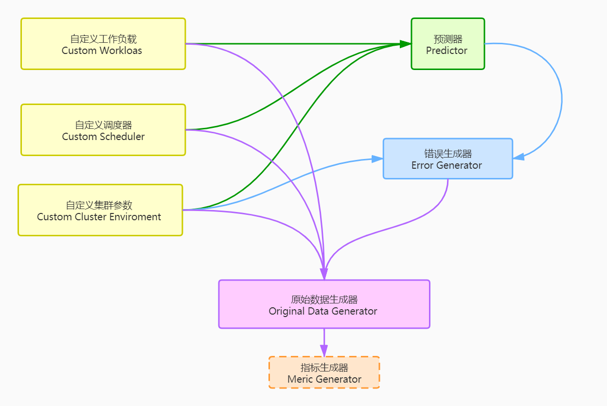

# DLTsim

A GPU cluster schedule simulator with an error generator.   

## 1 Get Started
0. You need [python3](https://www.python.org/) with [numpy module](https://numpy.org/) in Linux OS.
1. Clone the code to &lt;your_path/Simulator&gt;.
2. ```cd <your_path/Simulator>```
3. ```python3 Simulater.py```  
Then you can get an output looks like [output.out](output.out).

**Notes:**
+ The ***original running data*** in *&lt;output.out&gt;* is a dictionary to record original data of all jobs running information. 
+ Each job information is a list including ***start_time(int), end_time(int), and stop_reason(str)***. 
+ So that you can count any metric you want with ***finish_dict*** original data.

## 2 Introduction
<span id="2.1"> 

### 2.1 DLTsim Structure
DLTsim contains 6 basic parts, which are *custom workloas, custom cluster enviroment, custom scheduler, predictor, error generator, and original data generator.*
Besides, one optional part in DLTsim is *metric generator*. The structure of DLTsim is shown as following:
<span id="fig1">
  
 &#8195; &#8195; &#8195;  &#8195; &#8195; &#8195; &#8195; &#8195; &#8195; &#8195;*Fig.1 DLTsim Struture*

Each part in [Fig.1](#fig1) corresponds to the source code as follows:
+ Custom Workload: [worload.csv](workload.csv)
+ Custom Scheduler: [scheduler.py](scheduler.py)
+ Custom Cluster Environment: [Env.json](Env.json)
+ Predictor: The first return value of function ***gpu_limit_time()*** in [utilis.py](utilis.py)  
+ Error Generator: Function ***gen_error()*** in [utilis.py](utilis.py)
+ Original Data Generator: Function ***run_jobs()*** in [utilis.py](utilis.py)  
+ Metric Generator: Function ***gen_metric()*** in [utilis.py](utilis.py)  
  
### 2.2 File Structure
```
Simulator
├── Env.json
├── flow\ chart
│   ├── flow.pdf
│   ├── flow.png
│   └── flow.pos
├── output.out
├── __pycache__
│   ├── scheduler.cpython-36.pyc
│   └── utilis.cpython-36.pyc
├── scheduler.py
├── Simulator.py
├── utilis.py
└── workload.csv
```
**Implications:**
+ **Env.json:** The json file to config envionmental variables of cluster system.
+ **flow chart:** The folder to save flow chart of the program.
+ **output.out:** A sample of the output of the demo.
+ **scheduler.py:** Class of schedule policy.
+ **Simulator:** Entrance of the DLTsim program.
+ **utilis.py:** Function definitions and implementations.
+ **workload.csv:** All the jobs will be sent into GPU cluster.

## 3 Custom Parameters
### 3.1 Custom Cluster Environment
*Env.json* records custom cluster environment. There are 7 parameters in *Env.json* that you need to configure. 
The details as follows:  
+ **GPU_num_per_host:** An int type is needed to represents the number GPUs that each host has.
+ **Host_num:** An int type is needed to represents the number of hosts in the cluster.
+ **High_error_card:** An int type is needed to represents the number of high error rate GPUs in the cluster.
+ **High_error_rate:** A float type is needed to represents the error rate of high error rate GPUs. 
+ **Low_error_card:** An int type is needed to represents the number of low error rate GPUs in the cluster.
+ **Low_error_rate:** A float type is needed to represents the error rate of low error rate GPUs. 
+ **Max_err_num:** An int type is needed to represents the max error times generated by error generator for each GPU.
### 3.2 Custom Workloads
*workload.csv* records custom workloads.  
The first line of *workload.csv* is fixed. You need to modify from the 2nd line.  
Each line represents a workload with 8 parameters in that you need to edit. The details as follows:
+ **job_ID:** The sign of the job that can be a combination of letters and numbers. 
Note that the job_ID cannot be repeated, otherwise an error will be reported during the initialization process.
+ **submit_time:** The submission time of the job. It must be an integer. The default unit is second. **Note that the submit time of the first job must be ZERO**.
+ **running_time:** The running time required for a job to execute under ideal conditions without any interruption. 
It must be an integer. The default unit is second.
+ **GPU_num:** The number of GPUs required for the job.It must be an integer.
+ **restart:** The number of job restarts. It must be an integer. The default value is 0.
+ **preempt_times:** The number of times the job was preempted. It must be an integer. The default value is 0.
+ **err_times:** The number of times the job was interrupted due to GPU resource errors. 
It must be an integer. The default value is 0.
+ **score:** The score of the job as well as the priority of the job. The higher the score, the higher the priority.
It can be an integer or a floating point number.
### 3.3 Custom Scheduler
Please refer to [sec.4.2](#4.2).
## 4 Development
### 4.1 Important Variates
+ **workflow/workload/workloads(not case sensitive):**  
The unsubmitted job information.  
A nested dict (dict1{dict2}):  
```workloads[job_id] = dict2{}```  
The content of ```workloads[job_id]``` is a row of workload_file represents one job's information.  
The keys of dict2 is the first line in workload_file.   
+ **wait_q:**  
The interrupted job information due to recourse error or preemption.  
A nested dict (dict1{dict2}):  
```wait_q[job_id] = dict2{}```  
Normally, the content of ```wait_q[job_id]``` is copy from workflow(above variate).
+ **job_info:**  
One job information deep copy from wait_q or workflow. So that ```job_info``` is a dict recording *job_id, submit_time, running_time, restart, and so on*.  
Usage example: ```job_info["running_time"]```
<span id="finish">
 
+ **finish_dict:**  
To record job running information(starting time point, stopping time point, gpu_id, message), a.k.a., running original data.
The nested dict of list (dict{[]}).  
The keys of the dict is job ID.  
And ```finish_dict[job_id]```is a nested list. e.g.,```[[201, 323, [1, 4, 0, 2, 3], 'err'], [925, 1003, [0, 4, 3, 2, 1], 'None']]```  
So that ```times = len(finish_dict[job_id])```represents job's running times, a.k.a., the number of interruptions plus one.
+ **err/err_dict(not case sensitive):**  
To record cluster error information.
A dict. ```err[gpu_id] = list([list1],[list2])```  
Use gpu_id as a key to index error time of the gpu.  
The value of **err_dict** is a nested list, where the first list vik. list1 represents error start time, and the list2 represents error duration respectively.  
e.g., ```err_dict: {1: [[324, 459], [180, 90]], 2: [36],[179]}```  

<span id="4.2">
 
### 4.2 Schedule Policy
The default **scheduler policy(demo_scheduler)** has been writen into *scheduler.py*.  
Five method is necessary in scheduler class, which are *init_workflow, order, place, restart, and preempt.*    
The simple example of above 5 method implementation has been given in scheduler policy.  
#### 4.2.1 init_workflow
The aim of init_workflow method is to initializing job ID list. 
Normally, init_workflow has no need to override, just inherit from demo_scheduler.
#### 4.2.2 order
Assign a value to the score of each job including ***wait_q job*** and ***workload job***.  
The given score represents the priority of the job. The higher the score, the higher the priority. 
If the job's score in ```wait_q``` is equal to job's in ```workload```, then the job in ```wait_q``` has the higher priority.    
Function has no need to return values, just modify ```wait_q``` and ```workload``` dictionary directly.
#### 4.2.3 place
Placement policy implementation: give the resource allocation (GPU IDs) for a certain job.  
The input ```job_info``` is a dict passed from ```workload[job_id]``` or ```wait_q[job_id]```.  
Returns a gpu list which represents locational gpu ID(s). Note that gpu ID count from 0 and no host information.  
#### 4.2.4 restart
Determine whether the job needs to be restarted.  
Return a bool type. *True* represents restart, otherwise *False* means DO NOT restart.  
By the way, if you want to consider restart cost(default cost is zero), you can add it here by adding "running_time".  
For example, if the cost of each restart is 30s without any restart policy, then the implementation is as follows:
```angular2
def restart(job_id, wait_or_workload, wait_q, workload):
    if wait_or_workload == 'wait':
        wait_q[job_id]["running_time"] += 30
    elif wait_or_workload == 'workload':
        workload[job_id]["running_time"] += 30
    else:
        raise ValueError("Job: %s's wait_or_workload != 'wait' or 'workload'." % job_id)
    return False
```
#### 4.2.5 preempt
Determine whether high-scoring jobs can preempt low-scoring jobs.  
Return a bool type. *True* represents low-scoring job can be preempted, otherwise *False* means no preemption. 
### 4.3 Metric Generator
Metric generator is an **optinal** module as mentioned in [2.1 DLTsim Structure](#2.1).  
The function of metric generator is that generate specific metric(s) using original data([finish_dict mentioned in 3.0](#finish)) and custom workload([workload.csv](workload.csv)).  
If you need to analysis any metric, you can modify the *gen_metric* function in [utilis.py](utilis.py).
### 4.4 Original Data Generator
The original data generator is implemented in the ```run_job()``` function of [utilis.py](utilis.py).  
If you need to modify *Original Data Generator*, it will help to refer to [DLTsim-run_jobs.pdf](./flow%20chart/DLTsim-run_jobs.pdf).  
However, only Chinese flow chart has been offered. If you need English version, you can submit an issue, then we may add English one.
### 4.5 Error Generator
The error generator is implemented in the ```gen_error()``` function of [utilis.py](utilis.py).  
#### 4.5.1 Important Variables
+ **GPU_num:** The number of GPUs that can be used by the scheduler.
+ **High_err_num:** The number of GPUs with relatively higher error rate. 
Must be less than the total GPU number.
+ **High_err_rate:** The error rate of GPUs with relatively higher error rate.
Must be less than 1.
+ **Low_err_num:** The number of GPUs with relatively lower error rate. 
Must be less than the total GPU number.
+ **Low_err_rate:** The error rate of GPUs with relatively lower error rate.
Recommended to be smaller than *High_err_rate*. Must be less than 1.
+ **Workload:** The jobs which are not yet submitted to the scheduler.
+ **job_list:** The list of all jobs to be scheduled.
+ **recover_time:** The expected time cost for a GPU to recover from an error.
Must be an integer.
+ **scale:** The scale of time to reach the error rate.
Smaller scale means higher error frequency, vice versa.
+ **the output:** The time period when GPUs are dealing with errors.   
The result is presented in the form of a dictionary whose keys are ids of GPUs which may encounter errors.
For each key, the value is a list. The first element of the list is a list containing the time points when errors occur on the corresponding GPU. The second element is a list containing the time cost for recovery from each error.
#### 4.5.2 Sketch
The function **new_gen_error** aims on generating errors in a regular pattern.   
Errors arise at each time point for each GPU card at a certain probability, 
so that the total probability at which a GPU card encounters an error in `scale` time points equals to the error rate of the corresponding GPU card, 
namely `High_err_rate` or `Low_err_rate`.  
This implies that for a certain GPU card, the length of time between two errors subjects to exponential distribution.   
The function used this fact to efficiently gain the time points when errors arise, avoiding the high cost checking each time point for each GPU card.  
Besides, the time cost of recovery for each error is determined by function **new_gen_time_period** and its input `refValue`.   
The function is currently the identity function for its simplicity. 
If a more delicate model for recovery time is required, this function can always be verified.